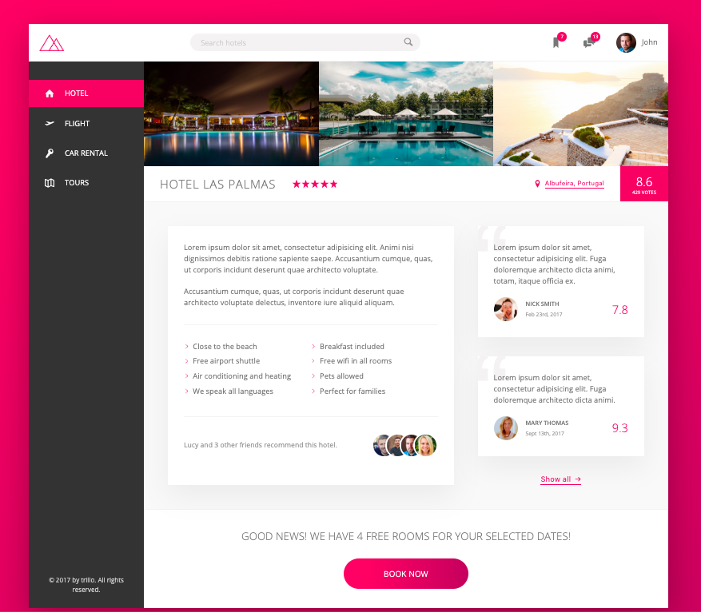

# Trillo - Your all-in-one booking app


[Trillo](https://raw.githack.com/KaushikShivam/Trillo/master/index.html) is a professional, flat and modern website tempate for the Travel industry. The template can be used for apps such as Travel blogs, Hotel bookings, Flight bookings and more.



## Table of content
- [Description](#description)
- [Installation](#installation)
- [Scripts](#scripts)
- [Contact](#contact)


## Description
This template only uses *Flexbox* for alignment and layout. So, no external framework is necessary. 
The project also implements the BEM-methodology for CSS classes. 

The project uses a lot of modern and experimental CSS rules and a build script is added to accomodate older browser compatibility.

## Installation

1. Clone the project to your local directory
```
git clone https://github.com/KaushikShivam/Trillo.git
```

2. The project uses NPM for managing dependencies. Run npm install to install all the required dependencies
```
npm install
```
3. Run the watch script to view live changes to your CSS
```
npm run watch:sass
```
4. Open the index.html file in your browser to view the website in all its glory (Live-server is recommended to view live changes automatically)


## Scripts
The project uses [AutoPrefixer](https://github.com/postcss/autoprefixer), [Node-sass](https://github.com/sass/node-sass), [npm-run-all](https://www.npmjs.com/package/npm-run-all) etc to build the following scripts:

### Watch changes in development
Watch live changes to the sass
```
"watch:sass": "node-sass sass/main.scss css/style.css -w"
```
Run ```npm run watch:sass``` to run the script

### Build script for production

1. Compile sass files
```
"compile:sass": "node-sass sass/main.scss css/style.comp.css"
```

2. Add prefixes automatically to the modern CSS rules (supports last 10 years - Can be configured)
```
"prefix:css": "postcss --use autoprefixer -b 'last 10 versions' css/style.comp.css -o css/style.prefix.css"
```

3. Adds compression
```
"compress:css": "node-sass css/style.prefix.css css/style.css --output-style compressed"
```
4. Final Build process
```
"build:css": "npm-run-all compile:sass prefix:css compress:css"
```

Run ```npm run build:css``` to run the build script

## Contact
You can contact me at:
- [Email](shivamkaushikofficial@gmail.com)
- [Linkedin](https://www.linkedin.com/in/shivam-kaushik-bb8162102/)
- [Twitter](https://twitter.com/kShivamDev)
- [Medium](https://medium.com/@shivamkaushikofficial)

